## MySQL Download

## **本次MySQL安装基于Ubuntu版本Ubuntu 24.04.3 LTS**

----

- ### 1. 前往官网下载对应系统的ATP仓库配置文件（获取最新版本的MySQL）

  - #### 官网地址：https://dev.mysql.com/downloads/repo/apt/

  - #### 除了去官网直接下载之外，也可以使用`wget`来下载

    - ##### 语法
      ```bash
      wget https://dev.mysql.com/get/mysql-apt-config_0.8.36-1_all.deb
      ```

    - ##### 结果
      

- ### 2. 安装仓库配置
  
  - ### 指令
    ```bash
    sudo dpkg -i mysql-apt-config_0.8.36-1_all.deb
    ```

  - ### 结果
    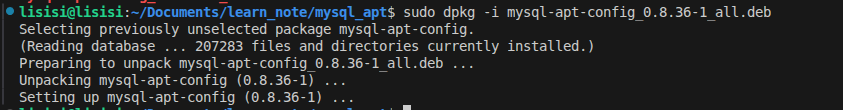

- ### 3. 仓库配置

  - #### 使用键盘上下键，先选择MySQL server，点击回车
    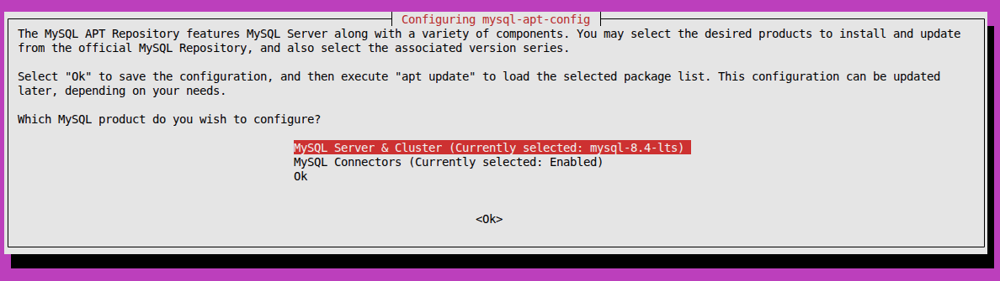

  - #### 找到一个自己喜欢的版本(**因为下载的APT仓库配置包不同，所以可以选择的版本也会有一定的区别**)
    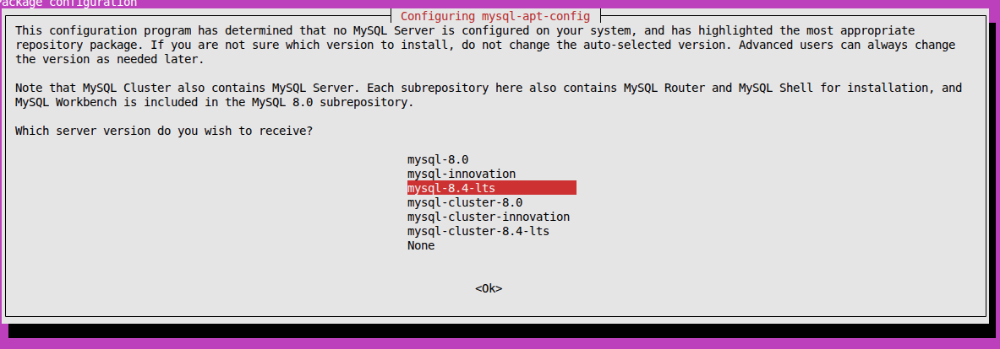
    #### 键盘上下键选择之后，回车确定就行。

  - #### 完成以上操作之后就会返回到初始的界面，和上面一样，选择`ok`，回车确定就行了。
    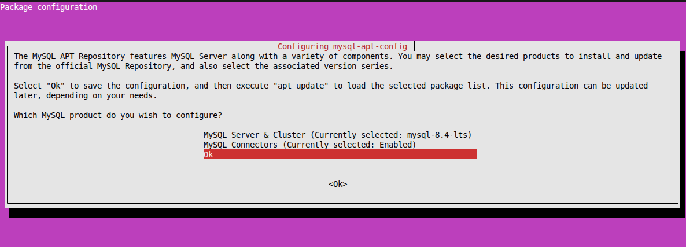

- ### 4. 安装MySQL
  
  - #### 更新仓库
    ```bash
    sudo apt upate
    ```

  - #### 使用指令查看是否有自己选择的版本
    ```bash
    apt-cache policy mysql-server
    ```
    #### 你可以看到以下信息
    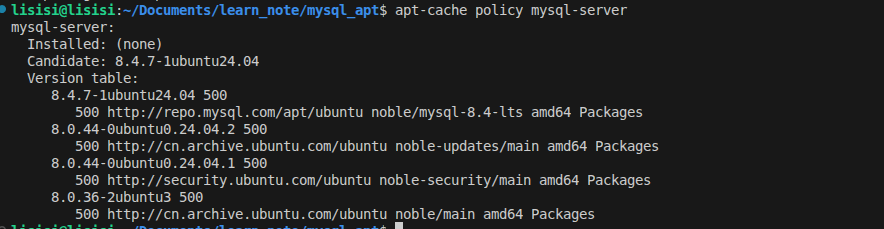
    | 字段 | 说明 |
    |------|------|
    | **Installed** | 当前系统是否已安装，以及安装的版本。若为 `(none)` 表示未安装。 |
    | **Candidate** | 如果你现在运行 `sudo apt install mysql-server`，APT 默认会安装这个版本（即“候选版本”）。 |
    | **Version table** | 列出所有可安装的版本，以及它们的来源和优先级。 |
    | **数字（如 500）** | APT 优先级（Preference）。数值越高，越优先被选中。默认仓库通常是 500。 |

  - #### 从图中可以看出我们刚刚选择的版本就是现在的候选版本
    ```bash
    sudo apt install mysql-server
    ```
    #### 如果你发现你要安装的版本不是默认安装的版本，可以尝试以下指令
    ```bash
    sudo apt install -f -y mysql-client=8.4* mysql-community-server=8.4*
    ```
    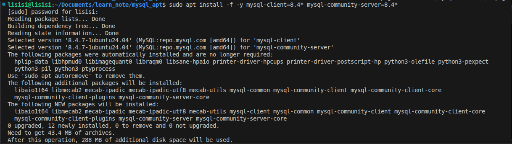

  - #### 之后会让你输入root密码（随便输入一个密码就行,但是需要记住，之后要用）
    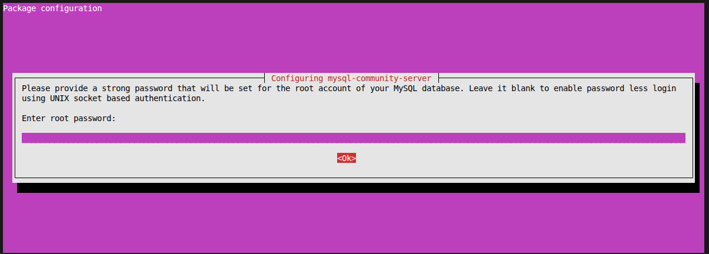
    #### 输入之后，键盘下键，选择`ok`，回车。

  - #### 确认密码
    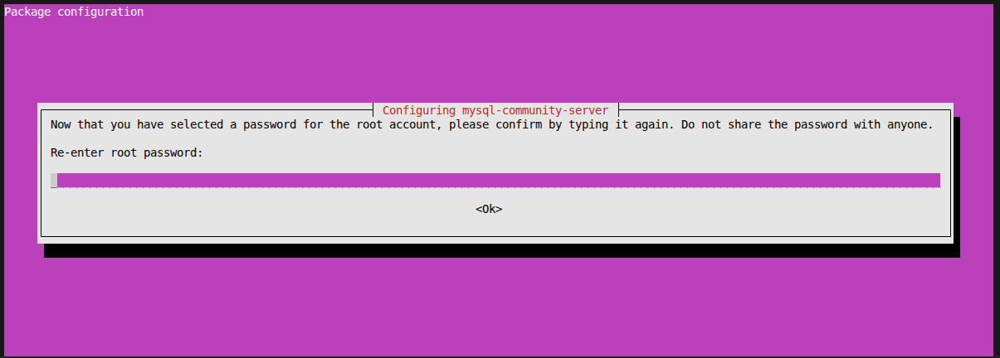
    #### 输入之后，键盘下键，选择`ok`，回车。

- ### 5. 安装成功
  
  - #### 等待一定时间
    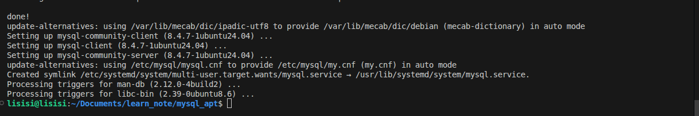
    #### 这样就算安装成功了

  - #### 测试是否安装成功
    ```bash
    mysql --version
    ```
    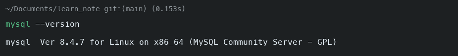
    #### 看到以上内容你就可以判断自己安装成功了

- ### 6.查看当前MySQL状态
  
  - #### 指令
    ```bash
    sudo systemctl status mysql
    ```
    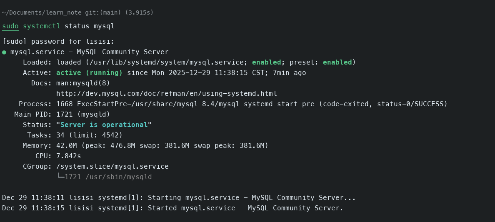
  
  - #### 如果你采用的是较老的ubuntu版本也可以尝试以下的指令
    ```bash
    /etc/init.d/mysql status
    ```

- ### 7. MySQL初始化

  - #### 指令
    ```bash
    mysql_secure_installation
    ```
    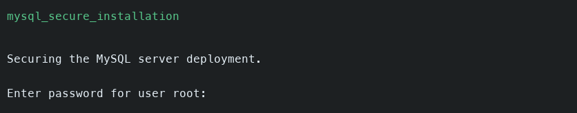
    #### 它会询问你密码，把刚刚设置的密码输入就行

  - #### 之后会询问你是否启用密码强度验证插件
    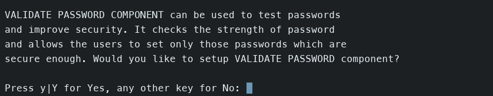

    - ##### 如果你想要启动点击`y`
      ##### 启用后，你可以选择以下策略等级
      | 级别（Policy） | 最低长度 | 要求                                                                 |
      |----------------|----------|----------------------------------------------------------------------|
      | `LOW`          | 8        | 仅要求密码长度 ≥ 8 位。                                              |
      | `MEDIUM`       | 8        | 长度 ≥ 8，并且必须包含以下四类字符中的**至少三类**：<br>• 小写字母（a-z）<br>• 大写字母（A-Z）<br>• 数字（0-9）<br>• 特殊字符（如 `!@#$%^&*`） |
      | `STRONG`       | 8        | 满足 `MEDIUM` 所有要求，**且不能包含字典中的单词**（需系统支持字典文件）。 |

    - #### 如果不启动，直接点击回车就行（本地开发，个人学习我们一般不启动）
  
  - #### 之后它会询问你是否修改root密码
    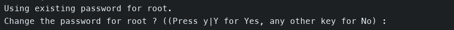

    - ##### 点击`y`，之后回车就是修改

    - ##### 直接回车就是不修改，还是我们之前设置的密码（这里我们选择不修改）。

  - #### 之后会询问你是否移除匿名用户
    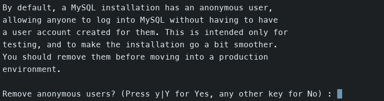
    #### 点击`y`，回车

  - #### 是否禁止远程root用户登陆
    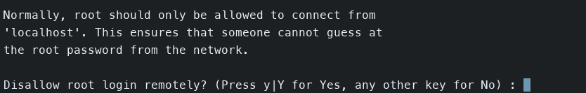
    #### 直接回车，允许

  - #### 是否移除自带的测试数据库
    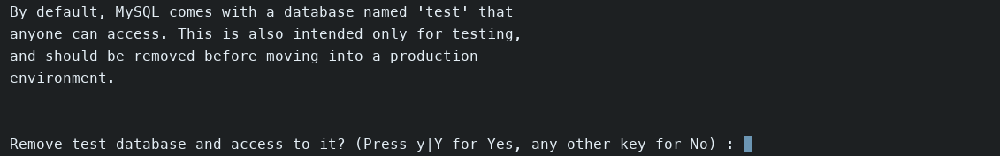
    ### 直接回车，不移除

  - #### 是否刷新权限
    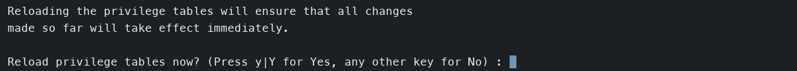
    #### 点击`y`，回车刷新

  - #### 看到以下结果就说明，MySQL初始化成功了
    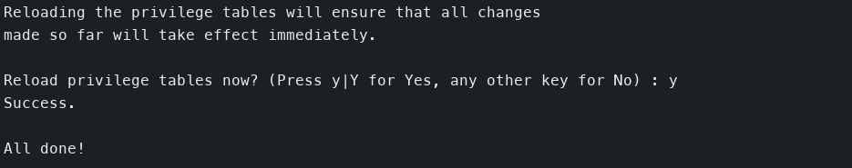

- ### 8. 测试是否可以成功登陆MySQL
  
  - #### 指令
    ```bash
    mysql -u root -p
    ```
    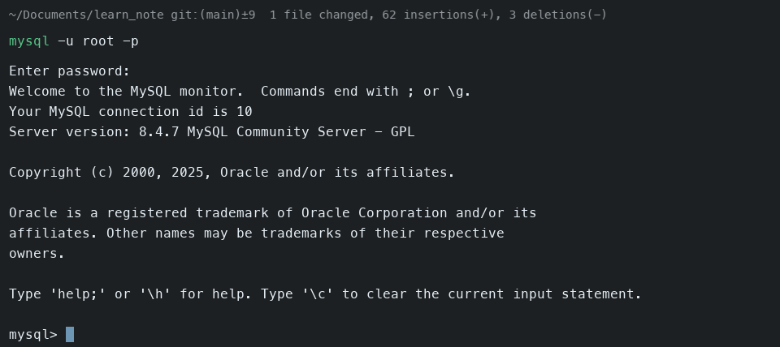

  - #### 之后会让你输入密码
    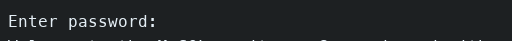
    #### 没有修改就输入你之前的密码，修改了就输入修改之后的密码