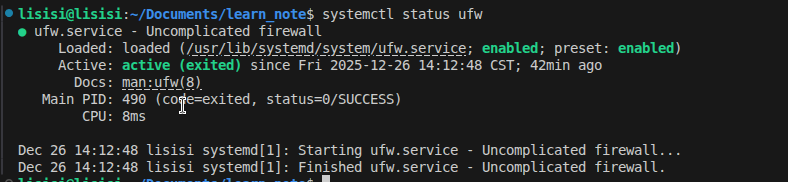

## systemctl

## Linux系统里面很多软件（内置的和第三方的）均支持使用systemctl命令控制：启动，停止，开机自启动能够被systemctl管理的软件，一般也称之为：服务。

- ### 1. 语法
  ```bash
  systemctl start/stop/status/enable/disable 服务名称
  ```
  - #### 参数
    |**参数**|**作用**|
    |:---:|:---:|
    |start|启动|
    |stop|结束/关闭|
    |status|产看状态|
    |enabel|开启开机自启动|
    |disable|关闭开机自启动|

  - #### 一些内置服务
    |**名称**|**服务**|
    |:---:|:---:|
    |NetworkManager|主网络服务|
    |network|副网络服务|
    |firewalld|防火墙服务|
    |sshd|ssh服务|


- ### 2. 实例
  