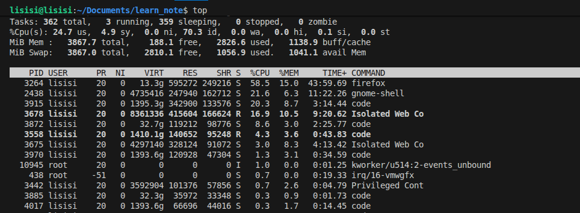

## 主机运行状态

- ### 1. 查看系统占用
  
  - #### 语法
    ```bash
    top
    ```
    #### 默认每5秒会刷新一次

  - #### 实例
    

  - #### 参数
    |**参数**|**作用**|
    |:--:|:--:|
    |`-p`|显示某个进程的信息|
    |`-d`|设置刷新时间，默认5s|
    |`-c`|显示产生进程的完整命令|
    |`-n`|指定刷新次数，`top -n 3`刷新输出3次后退出|
    |`-b`|以非交互非全屏方式0退出|
    |`-i`|不显示任何闲置或无用的进程|
    |`-u`|查找特定用户启动的进程|

- ### 2. 磁盘信息监控
  
  - #### 语法
    ```bash
    df [-h]
    ```
    `-h`以更人性化的单位显示

- ### 3. 查看cpu，磁盘相关信息
  
  - #### 语法
    ```bash
    iostat [-x] [num1] [num2]
    ```
    |**参数**|**作用**|
    |:---:|:---:|
    |`-x`|显示更多信息|
    |num1|刷新间隔|
    |num2|刷新次数|

- ### 4. 网络监控
  
  - #### 语法
    ```bash
    sar -n DEV num1 num2
    ```

  - #### 参数
    |**参数**|**作用**|
    |:---:|:---:|
    |`-n`|查看网络|
    |DEV|查看网络接口|
    |num1|刷新间隔|
    |num2|刷新次次数|