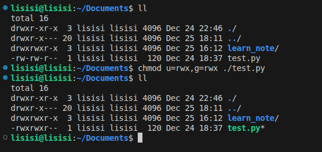
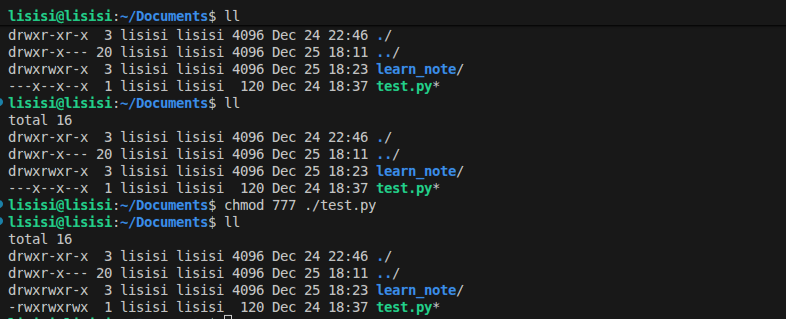

## 修改权限信息

### **只有文件或者目录的所属用户和root用户才有权限修改权限信息**

### 1. 语法
```bash
chmod [-R] 权限 文件或者文件夹
```
`-R`，的对目录里面的全部内容进行同样的操作

- #### 实例
  ```bash
  # 都好是必须的
  chmod u=rwx,g=rx,o=x test.txt
  ```
  

### 2. 简单的表示

- ### 1. 语法
  ```bash
  chmod 777 test.txt
  ```

- ### 2. 实例
  