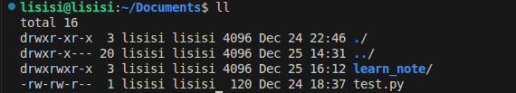

## 权限信息

### 1. 认知权限信息
- 
- #### 第3列表示文件/目录所属的用户
- #### 第四列表示文件/目录所属的用户组
- #### 第一列表示文件/目录权限控制信息
  
### 2. 权限的细节
|位置|作用|注意|
|:---:|:---:|:---:|
|0|`-`表示文件，`d`表示目录，`l`表示软连接|
|1|`r`表示读取权限，`-`表示没有权限|所属用户权限，对于目录就是查看权限|
|2|`w`表示写权限，`-`表示没有权限|所属用户权限，对于目录就是在目录里面创建，删除，改名等权限|
|3|`x`表示执行权限，`-`表示没有权限|所属用户权限，对于目录表示是否有进入该目录的权限，如`cd`|
|4|`r`表示读取权限，`-`表示没有权限|所属用户组权限，对于目录就是查看权限|
|5|`w`表示写权限，`-`表示没有权限|所属用户组权限，对于目录就是在目录里面创建，删除，改名等权限|
|6|`x`表示执行权限，`-`表示没有权限|所属用户组权限，对于目录表示是否有进入该目录的权限，如`cd`|
|7|`r`表示读取权限，`-`表示没有权限|其他用户权限，对于目录就是查看权限|
|8|`w`表示写权限，`-`表示没有权限|其他用户权限，对于目录就是在目录里面创建，删除，改名等权限|
|9|`x`表示执行权限，`-`表示没有权限|其他用户权限，对于目录表示是否有进入该目录的权限，如`cd`|