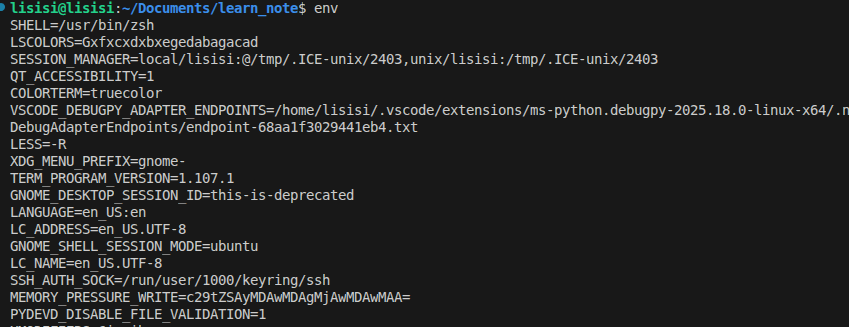
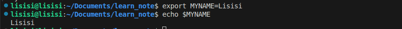
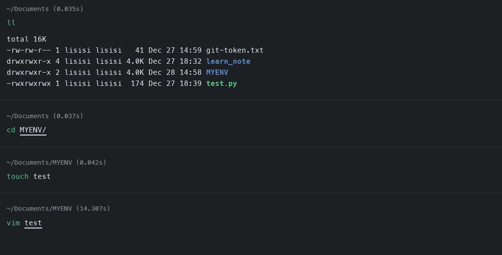
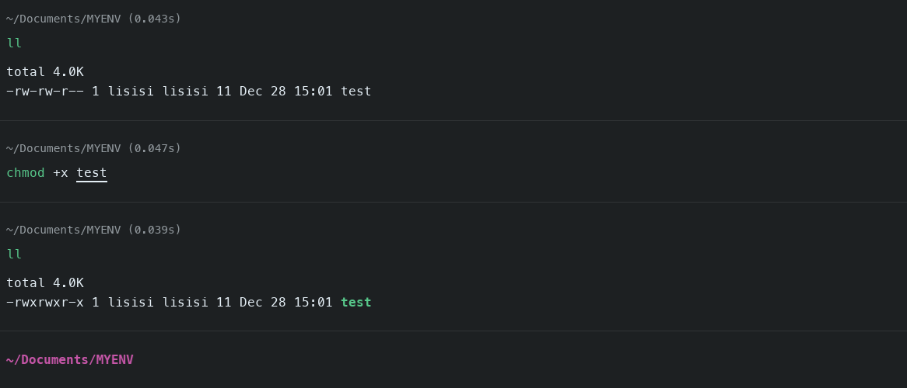

## 环境变量

- ### 1. 查看环境变量
  
  - #### 指令
    ```bash
    env
    ```

  - #### 实例
    

- ### 2. 自行设置环境变量（非永久）
  
  - #### 语法
    ```bash
    export VariableName=SetVariableName
    ```

  - #### 实例
    

- ### 3. 修改环境变量（永久）
  
  - #### 方法一
    ##### 针对当前用户更改，配置在当前用户的.bashre文件中

  - #### 方法二
    ##### 针对所用户生效，配置在系统的/ets/profile文件中

    #### 最后通过语法`source` 配置文件，进行立刻生效，或者重新登陆使之生效

- ### 4. 自定义环境变量
  
  - #### 演示
    
    - ##### 创建MYENV目录
      
    
    - ##### 同时在MYENV目录里面创建一个myenv文件，使用vim在里面写入`echo hahaha`
      

    - ##### 给test文件加速上可执行区权限
      

    - ##### 定义临时环境变量PATH，执行myenv
      