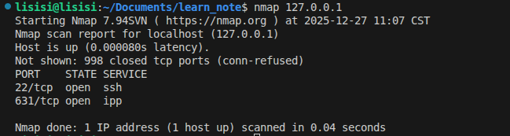
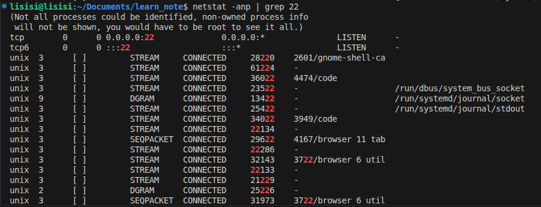

## 端口

- ### 1. 查看端口占用

  - #### 语法
    ```bash
    nmap IP地址
    ```
    #### 查看指定IP的对外暴露的端口

  - #### 注意
    ##### 使用之前需要先安装nmap

  - #### 实例
    

- ### 2. netstat查看端口占用情况
  
  - #### 语法
    ```bash
    netstat -anp | grep 端口号
    ```
    #### 查看本机指定端口号的占用情况

  - #### 注意
    ##### 使用之前先下载net-tools

  - #### 实例
    

- ### 3. nmap和netstat的区别
  | 特性 | `nmap` | `netstat` |
  |------|--------|-----------|
  | **作用对象** | 远程主机 / 网络 | 本机 |
  | **工作方式** | 主动扫描（发送探测包） | 被动查询（读取内核网络状态） |
  | **主要用途** | 渗透测试、网络发现、安全审计 | 故障排查、连接监控、服务调试 |
  | **是否跨主机** | ✅ 是 | ❌ 否 |
  | **现代替代品** | 无（仍是行业标准） | ✅ `ss`（推荐）、`lsof -i` |