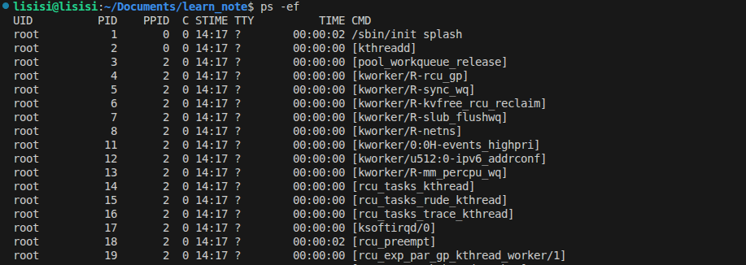

## 进程管理

- ### 1. 语法
  
  ```bash
  ps [-e -f]
  ```

  |**选项**|**作用**|
  |:---:|:---:|
  |`-e`|显示出所用的进程|
  |`-f`|以完整的格式化的形式显示信息|

  - #### 实例
    

- ### 2. 关闭进程
  
  - #### 语法
    ```bash
    kill [-9] 进程ID
    ```

  - #### 参数
    |**参数**|**作用**|
    |:---:|:---:|
    |`-9`|强制关闭进程|
    